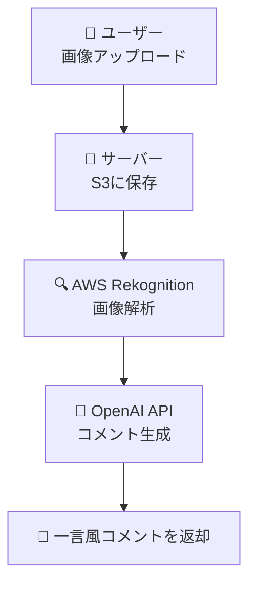
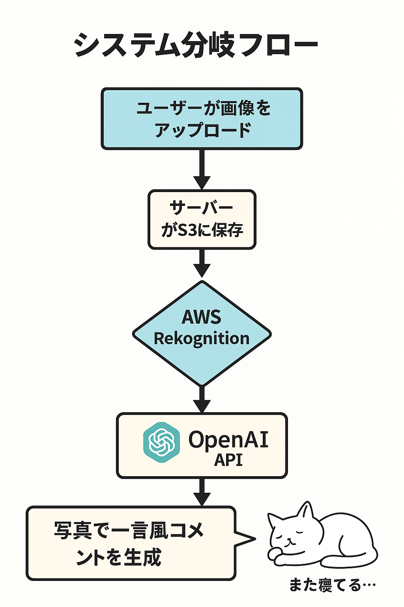
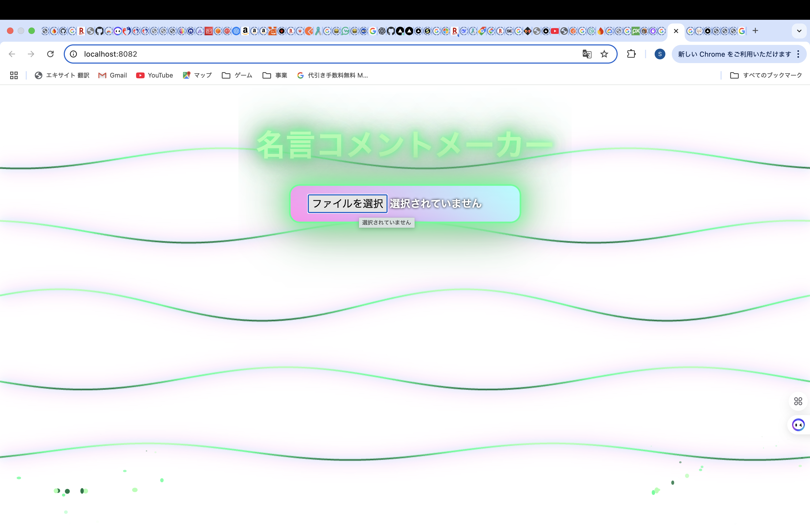
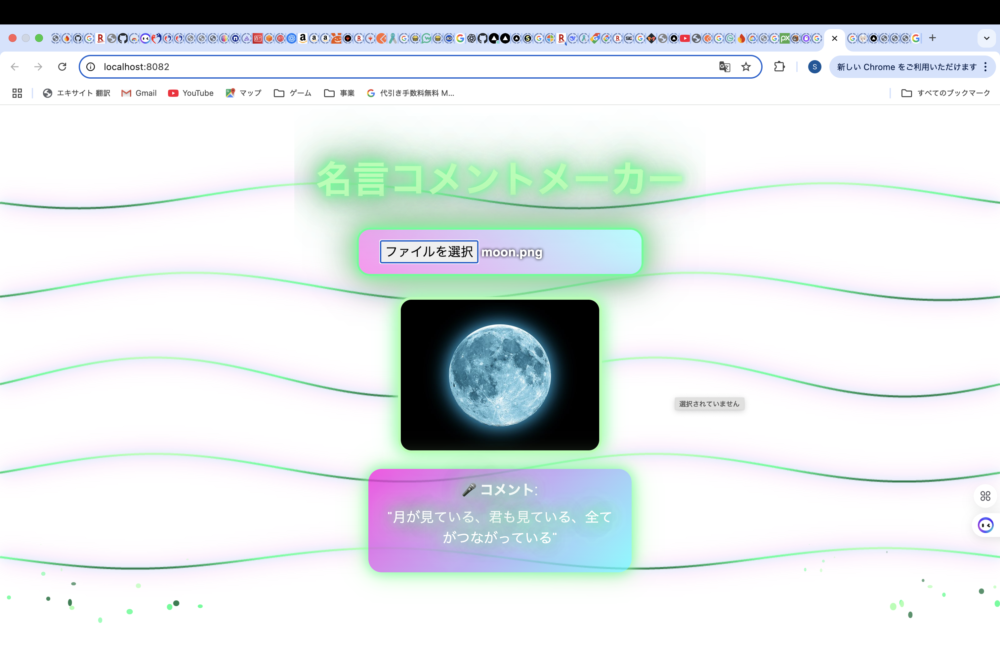

# 📸 名言コメントガチャアプリ
AI がアップロード画像を解析して「写真で一言」風コメントを生成する Web アプリ。


---

## 🏗️ アーキテクチャ

⚙️ 技術スタック
バックエンド: Python / Flask / boto3 / OpenAI API

フロントエンド(Web): React + TypeScript

インフラ: AWS S3, AWS Rekognition

その他: dotenv, flask-cors


## 🚀 セットアップ

### 🔧 バックエンド

```bash

python -m venv venv
source venv/bin/activate
pip install flask boto3 openai flask-cors python-dotenv
python analyze_with_gpt4v.py
```

`.env` に以下を設定：

env

OPENAI_API_KEY=sk-...
AWS_ACCESS_KEY_ID=...
AWS_SECRET_ACCESS_KEY=...
AWS_REGION=ap-northeast-1
S3_BUCKET_NAME=your-bucket-name
🐱 デモフロー
画像をアップロード

数秒後に AI がコメントを生成

結果を画面に表示 🎉





✨ 工夫ポイント
React Native→Web版対応への変更

OpenAI SDK のレスポンス変化に対応

CORS / multipart の安定対応

ユーザーの視覚体験の向上

💡 今後の改善案
🕰️　時間がすごくできた場合NativeとWebコードの混在を解消してデプロイ

🎭 コメントのテンション切り替え（真面目 / おふざけ）

🖼️ コメントを画像にオーバーレイ

👥 いいね機能などでユーザー同士の交流

😵 苦労したことと決断
デプロイには何度も挑戦しましたが、環境依存や CORS などで多くの時間を費やしました。
最終的に 「無理に中途半端なデプロイをせず、ローカル動作と README＋図解で説明する」 という判断をしました。
まず他のアプリを作り時間がある時再度デプロイチャレンジします（システムを移動して作り直すかもしれませんが。）

この経験から学んだこと：

技術的な粘り強さ

状況に応じた意思決定の重要性

NativeとWebコードの混在させてはいけないこと絶対！😭


